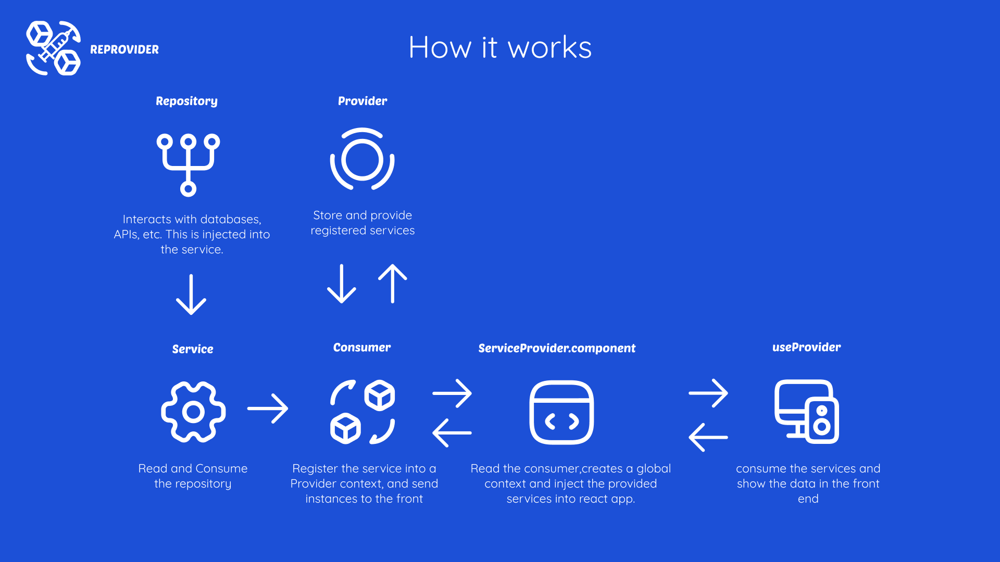
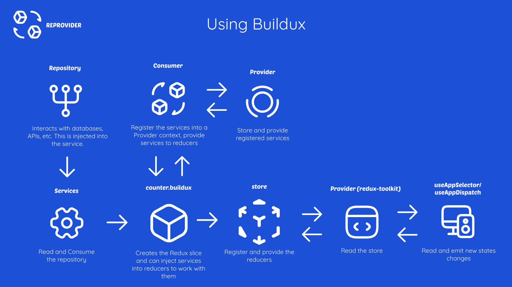

# Reprovider

A minimalist package created created for manage services using depedency injection easly and quickly.

## Overview

When our react app is scaling sometimes is necessary that we organize the logic for get a better understanding of our code.

Reprovider is designed for developers that want get a quickly and organized service provider in a react application using techniques like the Dependency Injection very simple.

With reprovider we can create services and consume into a component or outside of it.

Reprovider supports Redux for inject services into reducers and thunks. If you want use reprovider with redux, Read this [section](#buildux)

## How it works



# Quick start

### Install

with npm:

```powershell
    npm i reprovider
```

### Using Reprovider

First create the repository, it can contains the interacions with an A.P.I or Database.

_greets.repository.ts_

```typescript
export class GreetsRepository {
  hello = () => "Hello ";
  goodBay = () => "Goodbay ";
}
```

Now create the service and inject the repository into constructor.

_greets.service.ts_

```typescript
import { GreetsRepository } from "../repository/greets.repository";

export class GreetsService {
  constructor(private readonly repository: GreetsRepository) {}
  sayHello = (): string => `${this.repository.hello()} World From Reprovider`;
  sayGoodbye = (): string =>
    `${this.repository.goodBay()} World From Reprovider`;
}
```

Its time to create the registry file.

It contains all services with its dependencies that will register into ServiceProvider

_registry.ts_

```typescript
import { Service } from "reprovider";
import { GreetsService } from "./services/greets.service";
import { GreetsRepository } from "./repository/greets.repository";

export const services: Service[] = [
  {
    description: "Service for greeting people",
    service: GreetsService,
    dependencies: [GreetsRepository],
  },
];
```

Once do you configure the services and declared into registry file. FInally we can inject the services into the app.

For that, add the ServiceProvider at the top of the app.

The service provided will be responsible of create the context that we will using later calling the useProvider hook.

_app.tsx_

```typescript
import { ServiceProvider } from "reprovider";
import SayHello from "./components/say-hello.component";
import { services } from "./core/registry";

const App = (): JSX.Element => {
  return (
    <ServiceProvider services={services}>
      <SayHello />
    </ServiceProvider>
  );
};

export default App;
```

### Say hello with useProvider

Finally, just import the useProvider, pass the reference of Service that you wan use and desestructure the provider.

Optional: You can rename the provider as you want. This is recommended for understand the code, better.

_say-hello.component.tsx_

```typescript
import { useProvider } from "reprovider";
import { GreetsService } from "../core/services/greets.service";

/**
 * Show a simple hello world
 *
 */
const SayHello = () => {
  /**
   * Optional: Also we can rename the provider or use the standard reference.
   * Is recommended rename the provider for understand the code better
   */
  const { provider: greetsService } = useProvider(GreetsService);

  return (
    <div>
      <h1>{greetsService.sayHello()}</h1>
    </div>
  );
};

export default SayHello;
```

## Buildux

What is buildux?

Buildux is a slice builder that allows inject services into reducers and thunks creating a context and consume services from reducers easy. It works with redux-toolkit library.

### How Buildux Works

You can review the next graph for understand the buildux flow



### Usage

Install the dependencies

```powershell
npm install reprovider @reduxjs/toolkit react-redux
```

First create the state interface

counter-state.interface.ts

```typescript
export interface CounterState {
  value: number;
  
}

```

Now, create the buildux file, import the state, and pass the state type to the instance. This will return a context that you will use later in reducers.

counter.buildux.ts

```typescript
import { Buildux } from "reprovider";
import { CounterState } from "../../interfaces/counter-state.interface";

const { context } = new Buildux<CounterState>({
  name: "counter",
  initialState: { value: 0 },
})

```

After created the Buildux instance, we need create the reducers. For that, use the createReducers method:

counter.buildux.ts

```typescript
const { context } = new Buildux<CounterState>({
  name: "counter",
  initialState: { value: 0 },
}).createReducers({
  reducers: {
    increment: (state) => {
      state.value += 1;
    },
    decrement: (state) => {
      state.value -= 1;
    },
  },
});


```

then exports the actions created from reducers and the reducer from context:

counter.buildux.ts

```typescript
export const { increment, decrement } = context.actions;
export const counterReducer = context.reducer;
```

Now create the store and import the exported reducer from counter.buildux.ts

store.ts

```typescript
import { configureStore } from "@reduxjs/toolkit";
import { counterReducer } from "./counter-store/counter.buildux";

export const store = configureStore({
  reducer: {
    counter: counterReducer,
  },
});

export type RootState = ReturnType<typeof store.getState>;
export type AppDispatch = typeof store.dispatch;
```

In your index.tsx, import the store and the Provider Component and pass the store to tag.

```typescript
import React from "react";
import ReactDOM from "react-dom/client";
import App from "./App";
import "./index.css";

import { store } from "./core/store/store";
import { Provider } from "react-redux";

ReactDOM.createRoot(document.getElementById("root")!).render(
  <React.StrictMode>
    <Provider store={store}>
      <App />
    </Provider>
  </React.StrictMode>
);

```

For consume the reducers and dispatch actions we need create these hooks:

hooks.ts

```typescript
import { useDispatch, useSelector } from "react-redux";
import type { TypedUseSelectorHook } from "react-redux";
import { AppDispatch, RootState } from "../store/store";

//Hooks for read and emit states with redux.

//Calls an action
export const useAppDispatch: () => AppDispatch = useDispatch;

//Read the state
export const useAppSelector: TypedUseSelectorHook<RootState> = useSelector;

```

Now, we are ready to use the states and actions. For that, import the hooks in the component and use the hooks as follows:

app.tsx

```typescript
const count = useAppSelector((state) => state.counter.value);
  const dispatch = useAppDispatch();
```

app.tsx

```typescript
import reproviderLogo from "./assets/reprovider_logo.png";
import "./App.css";
import { useAppSelector, useAppDispatch } from "./core/hooks/hooks";
import {
  decrement,
  increment,
} from "./core/store/counter-store/counter.buildux";

function App() {
  const count = useAppSelector((state) => state.counter.value);
  const dispatch = useAppDispatch();
  return (
    <>
      <div>
        
        <a href="https://redux-toolkit.js.org/">
          
        </a>
      </div>
      <h1>Reprovider + Redux Example</h1>
      <div className="card">
        <button onClick={() => dispatch(increment(1))}>+1</button>
        <h1>Counter value is: {count}</h1>
        <button onClick={() => dispatch(decrement(1))}>-1</button>
        <p>
          Edit <code>src/App.tsx</code> and save to test HMR
        </p>
      </div>
    </>
  );
}

export default App;

```

You can read the complete example reading [here](https://github.com/Lopez15-Hub/reprovider/tree/master/examples/buildux-counter)

### Buildux Thunk

Overview

Buildux provide a custom thunk for asincronus calls and it's an implementation of [createAsyncThunk](https://redux-toolkit.js.org/usage/usage-guide#async-requests-with-createasyncthunk).

Creating a BuilduxThunk

```typescript

import { builduxThunk } from "reprovider";

builduxThunk<User[], void>({
    description: "Get user from API",
    reference: "/users",
    action: async () => {
      const usersService = context.consumer.get(UsersService);
      const users = await usersService.getUsers();
      return users;
    },
  }),
```

For use the thunk we need register into thunkRegistry method that it's provided when we create the Buildux instance

users.buildux.ts

```typescript
const { context, thunksRegistry } = new Buildux<UsersState>({
  name: "users",
  services,
  initialState: {
    users: [],
  },
});
//... Rest of code

//Register a new thunk.
thunksRegistry(context, (context) => [
  builduxThunk<User[], void>({
    description: "Get user from API",
    reference: "/users",
    action: async () => {
      const usersService = context.consumer.get(UsersService);
      const users = await usersService.getUsers();
      return users;
    },
  }),
]);
```

also we can declare our thunks out of our buildux file and the pass the reference into thunksRegistry.

users-thunks.registry.ts

```typescript
export const userThunksRegistry = <T>(context: BuilduxContext<T>) => [
  builduxThunk<User[], void>({
    description: "Get user from API",
    reference: "/users",
    action: async () => {
      const usersService = context.consumer.get(UsersService);
      const users = await usersService.getUsers();
      return users;
    },
  }),
];
```

then we can import it into buildux file.

users.buildux.ts

```typescript
const { context, thunksRegistry } = new Buildux<UsersState>({
  name: "users",
  services,
  initialState: {
    users: [],
  },
}).createReducers({
  reducers: {
    setUsers: (state, payload: PayloadAction<User[]>) => {
      state.users = payload.payload;
    },
  },
  extraReducers(builder: ActionReducerMapBuilder<UsersState>) {
    builder.addCase(
      context.thunks[0].fulfilled,
      (state, { payload }: PayloadAction<User[]>) => {
        if (payload) state.users = payload;
        console.log(state.users);
      }
    );
  },
});

thunksRegistry(context, userThunksRegistry);
```

### Buildux Examples

You can view the examples with buildux and thunks [here](https://github.com/Lopez15-Hub/reprovider/tree/master/examples)

### Injecting Services and consuming into reducer

If you need consume services into a reducer you can follow the next steps:

Create the registry file for store the services for slice

Recomendation:

It is recommended to create a registry for the slice and only insert the services that are part of it. This helps build a better code structure.

Create the registry file

registry.ts

```typescript
import { Service } from "reprovider";

export const services: Service[] = [
  {
    description: "Service for greeting people",
    service: UsersService,
    dependencies: [UsersRepository],
  },
];
```

users.buildux.ts

```typescript
import { services } from './registry'

const { context } = new Buildux<UsersState>({
  name: "users",
  services
  initialState: {
    name: "",
    lastName: "",
    email: "",
  },
}).createReducers({
  getUsers: (state) => {
    const service = service.consumer.get(MyService)
    // Do something with your service...
    state.value += 1;

  },

});
```

### Consuming services into a thunk

```typescript
//Register a new thunk.
thunksRegistry(context, (context) => [
  builduxThunk<User[], void>({
    description: "Get user from API",
    reference: "/users",
    action: async () => {
      // Read the service from context
      const usersService = context.consumer.get(UsersService);
      const users = await usersService.getUsers();
      return users;
    },
  }),
]);
```

## Examples

You can view more examples follow this _[link](https://github.com/Lopez15-Hub/reprovider/tree/master/examples)_
